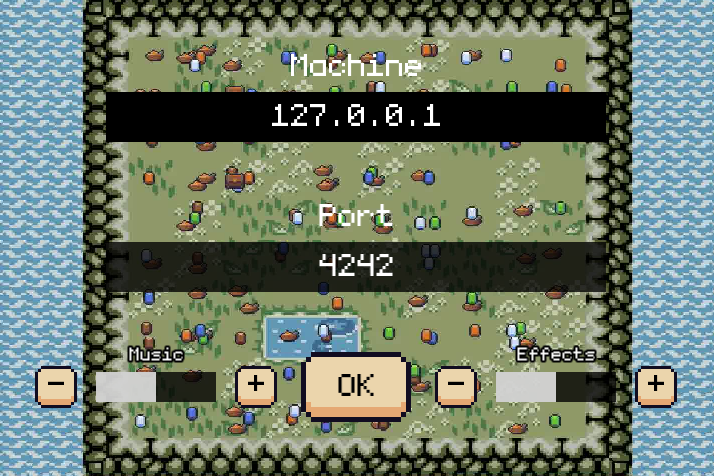

# Zappy
Zappy is a multiplayer game played by teams of IA-controlled players. The world is viewed using a graphic client. The goal for each team is to collect as many resources as possible to level up and get enough resources to win the game.

# Usage
## Compilling
This project uses CMake to compile. To compile, run the following commands:
```
cmake -S . -B build
cmake --build build
```
## Running
To run the server, run the following command with the desired arguments:
```
USAGE: ./zappy_server [OPTIONS]
OPTIONS: (R)equired (O)ptional
 R      -p --port <port>                Port number
 R      -x --width <width>              World width
 R      -y --height <height>            World height
 R      -n --name [<name>,...]          Team names
 R      -c --clientsNb <number>         Number of authorized clients per team
 R      -f --freq <frequency>           Frequency of the server
 O      -h --help                       Display this help
```
To run the client, run the following command with the desired arguments:
```
USAGE: ./zappy_ai [OPTIONS]
OPTIONS: (R)equired (O)ptional
 R      -p --port <port>                Port number
 R      -n --name <name>                Team name
 O      -h --help                       Display this help
```

To run the graphic client, run the following command with the desired arguments:
```
USAGE: ./zappy_gui
```

# Images



# Pipelines
[](https://github.com/EpitechPromo2026/B-YEP-400-MAR-4-1-zappy-erwan.gonzales/actions/workflows/compilation.yml)
